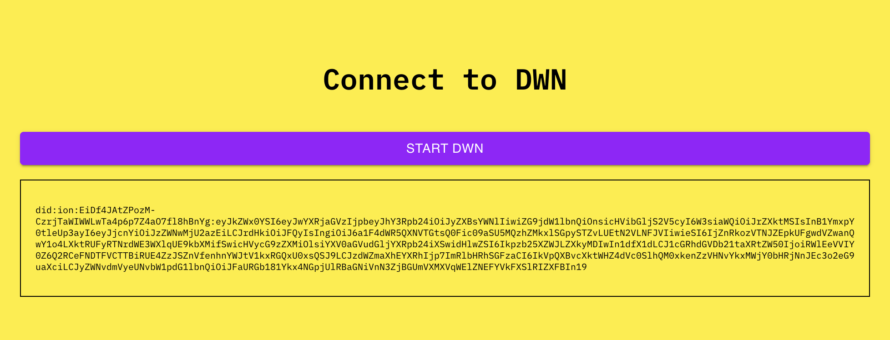
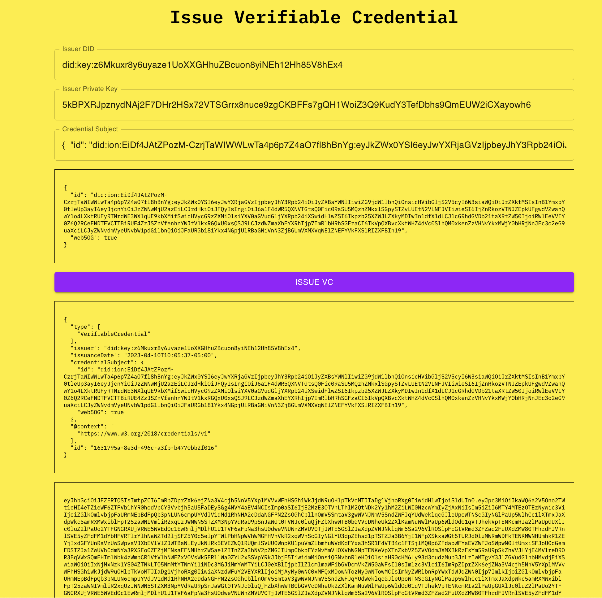
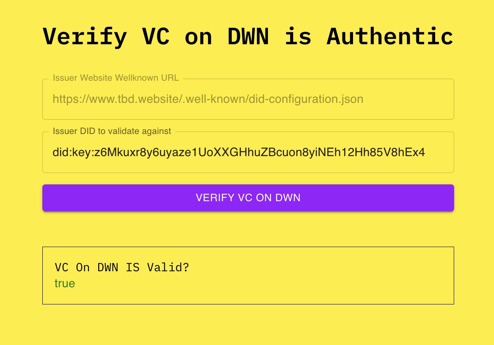

## Issue Verifiable Credentials On A DWN

To run the demo simply run:
```
cd dwn-verifiable-credentials-demo
npm install
npm start
```

## Features
The application consists of the following sections:

- Connect to DWN: Allows users to connect to a Decentralized Web Node (DWN) that is created in the users browser using web5-js https://www.npmjs.com/package/@tbd54566975/web5

- Issue Verifiable Credential: Lets users issue a Verifiable Credential (VC) by providing the issuer's public and private keys, and the credential subject. The issued VC is displayed in both JSON and JWT format.

- Send VC to a DWN: Allows users to send the issued VC to a DWN. The response is displayed in a formatted output box.

- Verify VC is Authentic: Users can verify if the VC is authentic by providing the VC JWT, issuer DID, and the issuer's well-known URL. The application will indicate whether the VC is valid or not.

- Verify VCs on DWN. Allows users to verify VCs stored on a DWN.

## Example Walkthrough
This is a example walkthrough of creating a DWN in your browser, creating a VC and storing it in your DWN, and then verifying that the DWN is authentic. Information in the demo is pre-filled so you can just click the buttons for the default example, or fill in your own values. An interesting use case is uing a [DID Well Known](https://www.tbd.website/.well-known/did-configuration.json) document to issue a credential and verify that it came from that source


First a user will initialize a DWN. This creates a keypair and starts a DWN in the browser using the [Web5 SDK](https://www.npmjs.com/package/@tbd54566975/web5). A DWN is now running locally in the browser


This will use the [SSI-SDK-WASM](https://github.com/TBD54566975/ssi-sdk-wasm) to generate a verifiable credential. You set the issuer's public DID and the issuer's base58 private key. You set the credential subject to whoever you want to issue it to. 
- Notice: The credential subject's ID defaults to the DWN's DID. This ensures that the issued VC is issued to the DWN user




Now that the user has created the VC the user can now send the VC to the local DWN. This is done as a web5.dwn.records.write call. 


This module works as a generic verification tool to examine if a VC is authentic. It does this by taking the VC in JWT format and the issuer who is supposed to be issuing the did. If they match up the SSI-SDK cryptographically verifies that this is in face a valid JWT. 
- If you add another person or entities random DID you will see that it will NOT be authentic. It's only authentic if the "Issuer DID to validate against" is the same issuer who issued the VC


This will do the same as above but instead of copy pasting the VCJWT it will query the VC that was sent to the DWN
