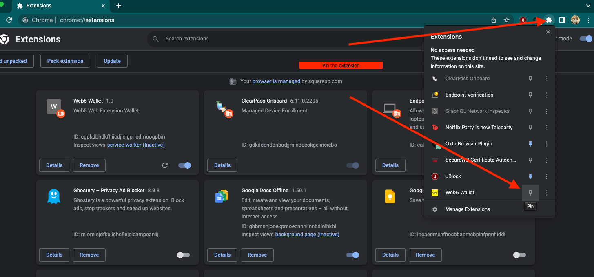

# Web5 Wallet

## Build instructions

```
npm install --install-links
npm run build
```

## Installing the extension into chrome

* Open Chrome and open a new window
* navigate to `chrome://extensions`
* toggle Developer Mode on (toggle should be on top right)
* click on the `Load Unpacked` button
* navigate to `web5-labs/web5-wallet/dist` and click "Select" button. This will intall the extension.
* Pin the extension: click the puzzle icon to the right of URL bar and click the pushpin icon next to Web5 Wallet (see image below):

see this image for reference:
